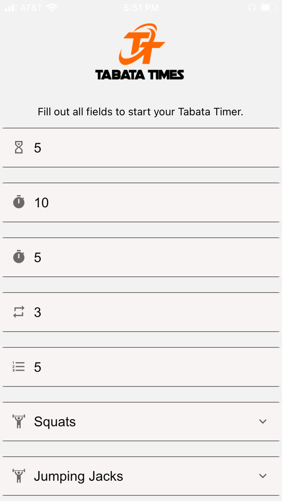
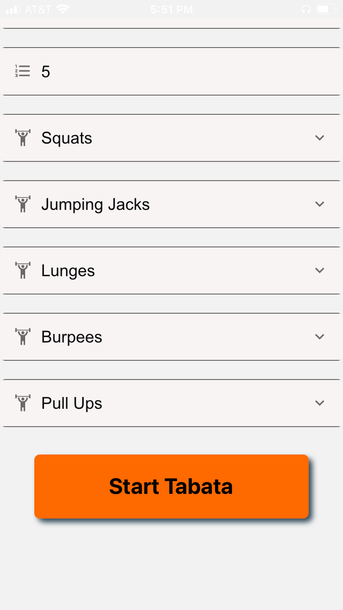
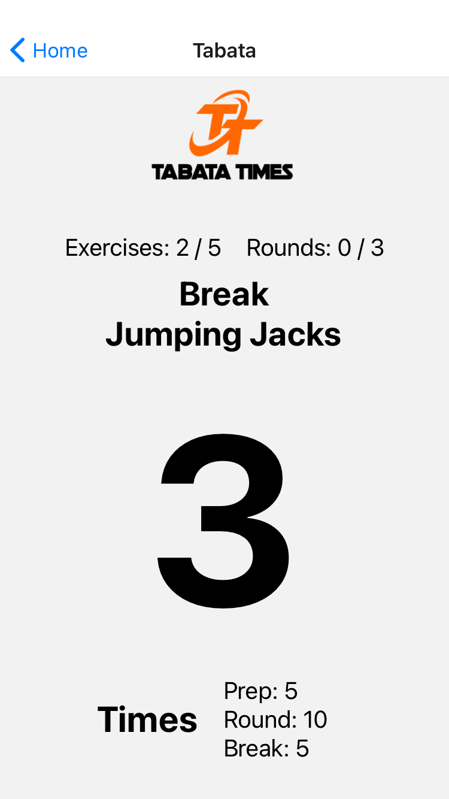

## TabataTimer

This is a React Native mobile app built for a client. The concept is a branded Tabata Timer app for users to use for exercising w [Tabata methodology](https://www.active.com/fitness/articles/what-is-tabata-training).

### The requirements to implement were:

User can enter:
Initial Countdown (In seconds)
Interval Inputs (In seconds)
Exercise (Select)
Rest (In Seconds)
Number of Sets (In Seconds)
Number of Rounds (In Seconds)

Tabata
Show large number of rounds completed (ex: 1/10 )

-------
## Demo

See screen captures and a 3x sped up screen capture demo below:

SCREEN CAPTURES:

